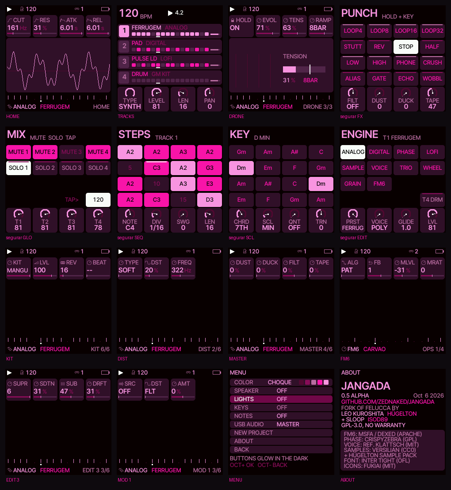
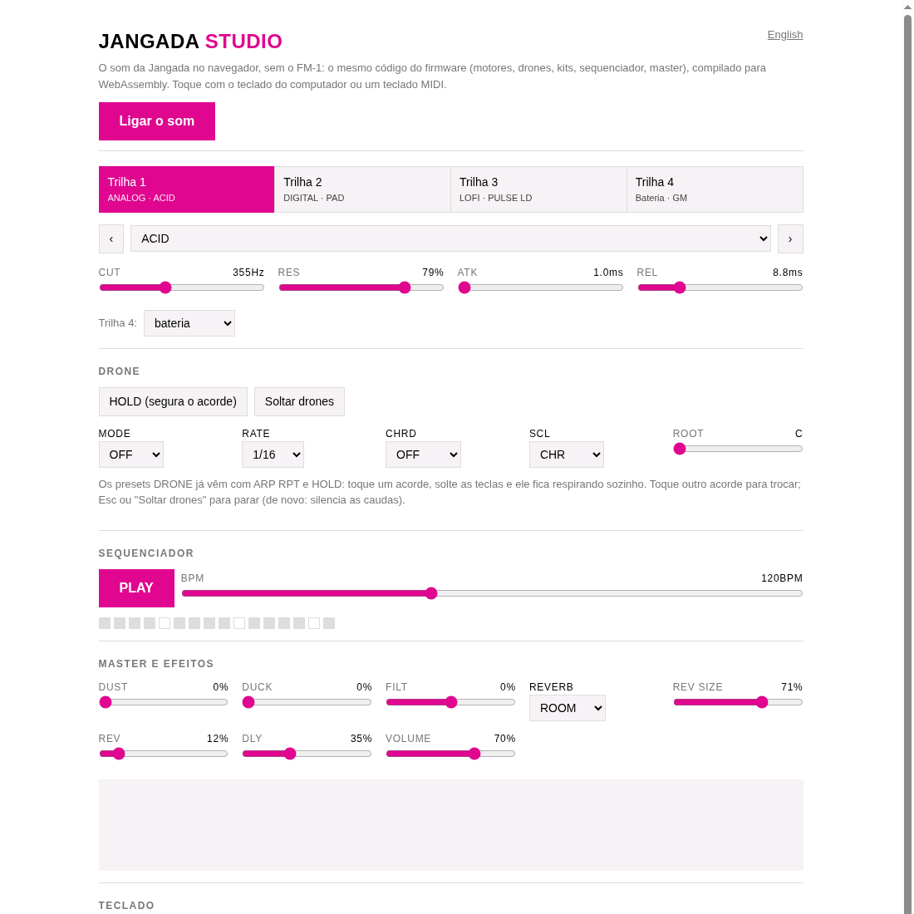

<p align="center"></p>

<p align="center">
<a href="README.md">English</a> · <b>Português</b><br>
<a href="https://github.com/zednaked/jangada/actions/workflows/ci.yml"></a>


<a href="https://github.com/zednaked/jangada/releases/latest"></a>
</p>

# Jangada 🛶

**Firmware alternativo para o M-VAVE FM-1, com sotaque escuro, industrial e brasileiro.**

Drones que respiram e evoluem sozinhos, ferrugem, fita gasta, máquinas e manguebeat, num synth de bolso
baratinho. Dez motores de síntese (FM de 6 operadores que conversa com o Dexed, um analógico com
superwave e filtro ladder no estilo Moog), quatro trilhas, matriz de modulação, kits de bateria próprios, efeitos para tocar ao vivo.

Um fork do [Felucca](https://github.com/hugelton/Felucca) de Leo Kuroshita (Hügelton Instruments).
A felucca é o barco à vela do Nilo; a jangada é a nossa.

**[Toque no navegador](https://zednaked.github.io/jangada/webapp/studio/)** ·
**[Instale](https://zednaked.github.io/jangada/)** ·
**[Ouça](#ouça)** ·
**[Releases](https://github.com/zednaked/jangada/releases)**

> **Alfa.** Use por sua conta e risco. A área de boot do FM-1 nunca é tocada, e dá para voltar ao
> firmware oficial a qualquer momento.

<p align="center"></p>

## Filosofia

A Jangada não quer ser um compêndio dos outros firmwares do FM-1. Ela tem um gosto:

- **Escuro e industrial.** Para quem pensa em Nine Inch Nails, *The Downward Spiral*, *Ghosts I–IV*,
  trilhas de cinema: sons com ferrugem, grão, fita gasta, zumbido de fundo, metal, pianos quebrados.
- **Drones como linguagem.** Um acorde que se sustenta e respira sozinho enquanto você toca o resto, e
  que evolui devagar, com uma tensão que abre ao longo de compassos. É a ideia mais nossa.
- **Brasileiro.** Jangada é nome de barco do Nordeste. O **manguebeat** (Chico Science & Nação Zumbi)
  já juntava maracatu com peso industrial: é esse o nosso cruzamento. Alfaia, zabumba, gonguê, agogô e
  cuíca; maracatu, baião e coco; a escala nordestina; rabeca e sanfona em drone.
- **Feito para tocar ao vivo.** Segurar um botão e mudar tudo, efeitos que entram com um dedo, nada que
  obrigue a olhar a tela.

Trazemos o que há de bom nos outros forks (Felucca 1.0, SLOOP, Felucca [Salt], Melodee) quando serve a
esse gosto, sempre com o nome e a cara da Jangada e com os créditos de quem fez. O que é só mais do
mesmo fica de fora.

## Ouça

Tudo gerado pelo próprio DSP do firmware (o mesmo código C que roda no FM-1, rodando num PC).

**Drones que evoluem** (cerca de um minuto cada: o som anda sozinho)

| | |
|---|---|
| [FERRUGEM](docs/sounds/drone-ferrugem.mp3) | superwave que enferruja, a tensão subindo em 16 compassos |
| [SERTAO](docs/sounds/drone-sertao.mp3) | a sanfona que azeda |
| [CINZA](docs/sounds/drone-cinza.mp3) | cinza de piano em grãos |
| [ABISMO](docs/sounds/drone-abismo.mp3) | FM que vai abrindo |
| [tensão em rampa](docs/sounds/drone-tension-ramp.mp3) | TENS de 0 a 100 % em 16 compassos |
| [parado × evoluindo](docs/sounds/drone-static-vs-evolving.mp3) | o mesmo drone sem e com EVOL |

**Mangue** · [MARACATU](docs/sounds/mangue-maracatu.mp3) (baque virado) ·
[BAIAO](docs/sounds/mangue-baiao.mp3) · [COCO](docs/sounds/mangue-coco.mp3) ·
[baião com baixo e sanfona](docs/sounds/baiao-bass-sanfona.mp3) ·
[coco com rabeca](docs/sounds/coco-rabeca.mp3)

**Máquinas** · [RUST](docs/sounds/kit-rust-grind.mp3) · [FORGE](docs/sounds/kit-forge-anvil.mp3) ·
[PISTON](docs/sounds/kit-piston-engine.mp3) · [HURT](docs/sounds/kit-hurt-fragile.mp3)

**Sujeira** · [seco](docs/sounds/grit-dry.mp3) → [fita gasta](docs/sounds/grit-tape.mp3) →
[zumbido, fita e poeira](docs/sounds/grit-hum-tape-dust.mp3) → [tudo](docs/sounds/grit-all.mp3) ·
baixo em [FUZZ](docs/sounds/grit-bass-fuzz.mp3), [FOLD](docs/sounds/grit-bass-fold.mp3) e
[RING](docs/sounds/grit-bass-ring.mp3)

**Da 0.1** · [RUST BASS](docs/sounds/rust-bass.mp3) · [HURT PAD](docs/sounds/hurt-pad.mp3) ·
[GRIND LEAD](docs/sounds/grind-lead.mp3) · [MACHINE](docs/sounds/machine.mp3) ·
[METAL HIT](docs/sounds/metal-hit.mp3) · [BROKEN BELL](docs/sounds/broken-bell.mp3) ·
[STATIC](docs/sounds/static.mp3) · [GHOST KEYS](docs/sounds/ghost-keys.mp3) ·
[DIRTY ORGAN](docs/sounds/dirty-organ.mp3) · [DRONE SAW](docs/sounds/drone-saw.mp3) ·
[DRONE RING](docs/sounds/drone-ring.mp3) · [DRONE FM](docs/sounds/drone-fm.mp3) ·
[DRONE VOX](docs/sounds/drone-vox.mp3) · [SUPER SAW](docs/sounds/super-saw.mp3) ·
[SUPER PAD](docs/sounds/super-pad.mp3) · [HP SHIMMER](docs/sounds/hp-shimmer.mp3) ·
[quatro trilhas juntas](docs/sounds/four-tracks.mp3)

## Toque no navegador

<a href="https://zednaked.github.io/jangada/webapp/studio/"></a>

O **[Jangada Studio](https://zednaked.github.io/jangada/webapp/studio/)** roda o DSP do firmware em
WebAssembly, amostra por amostra igual ao aparelho: escolha trilha e preset, toque com o teclado do
computador (ou um teclado MIDI), segure drones, rode o sequenciador, mexa no master. Não precisa do
FM-1, e nada sai do seu navegador.

## Em números

| | |
|---|---|
| **Motores** | 10: ANALOG (superwave, filtro ladder estilo Moog), FM6 (6 operadores, Dexed), DIGITAL (FM 4 op), PHASE, LOFI, SAMPLE, VOICE, TRIO, WHEEL, GRAIN |
| **Vozes e trilhas** | 8 vozes por 4 trilhas (3 synths + bateria, ou 4 synths) |
| **Parâmetros** | 16 por motor, matriz de modulação de 4 slots com 13 origens (4 delas knobs de macro) |
| **Presets** | 93 de fábrica (31 escuros, drones e nordestinos da Jangada), 32 de usuário, 72 patches FM6 (8 + dois bancos de 32) |
| **Bateria** | 5 kits da Jangada + 32 sintetizados + GM; 7 batidas de fábrica |
| **Sequencer** | 64 passos por trilha, acordes, ratchet, chance, acento, slide, swing; arp UDI / RPT até 4 compassos |
| **Efeitos** | distorção por trilha (5 tipos), SLICER, chorus, delay, 3 reverbs, DUST / DUCK / FILT / TAPE / HUM no master, 16 punch-ins |
| **Ao vivo** | 5 camadas (segurar um botão), drones com HOLD, EVOL, TENS, RAMP |
| **Conexões** | USB MIDI + áudio (entrada estéreo 44,1 kHz) + console, MIDI TRS, clock in (USB / TRS) e out |
| **Memória** | 4 projetos, autosave, backup completo pelo editor, projetos e presets com chaves estáveis |
| **Hardware** | o FM-1 de fábrica: nada a soldar, a área de boot nunca é tocada |

## Instalar

Versão atual: **[Jangada 0.8](https://github.com/zednaked/jangada/releases/tag/v0.8)** (alfa).
Conecte o FM-1 direto no computador por um cabo USB **de dados**.

**Mac / Windows / Linux, pelo navegador**: abra o
**[instalador web da Jangada](https://zednaked.github.io/jangada/)** no Chrome ou no Edge e aperte
*Instalar*. Ele já traz a última versão; ao lado ficam o editor e o Studio.

**Linux, pelo terminal**: clone este repositório e rode

```
./instalar-linux.sh                    # baixa e instala a última versão publicada
./instalar-linux.sh jangada-0.8.fwsc   # instala um arquivo baixado das releases
./instalar-linux.sh --original         # volta ao firmware oficial da M-VAVE (V15)
./instalar-linux.sh --info             # o que o FM-1 está rodando
./instalar-linux.sh --console          # acesso ao console serial (regra udev, pede sudo)
```

O script prepara sozinho um ambiente Python (`mido` + `python-rtmidi`) em `~/.local/share/jangada/`
e confere o SHA-256 do que baixou.

- **Se a instalação falhar**: segure **OCT−** ao ligar o FM-1 (resgate por USB) e instale de novo. Já
  passamos por isso de verdade: uma gravação da 0.5.1 caiu no meio (cabo), o FM-1 ligou em *JANGADA USB
  RESCUE*, o instalador gravou por ele e o aparelho voltou inteiro.
- **Voltar ao oficial**: pelo instalador web (com um backup antes), `./instalar-linux.sh --original`,
  ou o M-UPGRADE da M-VAVE.
- Desde a 0.2 o FM-1 aparece no computador como **Jangada** (MIDI e áudio). O instalador web do
  Felucca não acha mais um FM-1 com a Jangada: use o da Jangada.

## Primeiros passos

1. **Um drone.** PRESETS até **FERRUGEM** (ANALOG), toque um acorde e solte: ele fica respirando e
   evoluindo sozinho. Toque ARP até a página **DRONE** e gire **TENS**. **Segure ARP** para soltar o
   drone; segure de novo para calar as caudas.
2. **O mangue.** ALGORITHM até a trilha 4, PRESETS até o kit **MANGUE**: a batida de maracatu já vem
   junto. Aperte PLAY. Em **GLO → KIT**, o knob BEAT troca para baião ou coco.
3. **Sujeira.** Segure **FX**: as teclas brancas viram 16 efeitos (loops, reverse, tape stop…) e os
   knobs viram FILT, DUST, DUCK e TAPE.
4. **Mix ao vivo.** Segure **GLO**: teclas 1–4 mute, 5–8 solo, 9 segurada uma virada, 10 o próximo
   compasso uma virada, a última é tap tempo.
5. **Gravar.** O **REC** numa página sem nada para gravar abre a tela de trilhas; o FM-1 também é uma
   placa de som: grave o master no computador pela entrada **Jangada**.

## O que tem

### Drones
Os presets de drone usam o arpejador em **RPT** a cada **4 compassos** com **HOLD**: toque um acorde,
solte, e ele continua respirando sozinho, inclusive enquanto você toca outras trilhas.
- **Segure ARP** → DRONE OFF (os acordes presos saem com o release); **de novo** → SILENCE.
- **Página DRONE** (toque ARP até ela): **HOLD**, **EVOL**, **TENS**, **RAMP**, por trilha.
  - **EVOL**: passeios aleatórios lentos e suaves (ciclos de dezenas de segundos a minutos, nunca
    iguais) movem o filtro, a forma e o parâmetro natural do motor; cada voz desafina e respira do seu
    jeito. Para quando o drone para; um drone novo começa do som do preset.
  - **TENS**: abre o filtro, sobe ressonância, drive e brilho, separa as vozes (até ±12 cents) e deixa
    o passeio mais fundo e rápido. Em 0, nada muda.
  - **RAMP**: OFF ou 1 a 32 compassos para a tensão chegar ao TENS, no tempo. Um drone que nasce do
    silêncio começa em 0 e constrói.
  - A tela mostra os quatro passeios e a barra da tensão.
- Na matriz de modulação, a origem **DRIFT** é o passeio da trilha, para qualquer destino.
- Presets: **FERRUGEM** (ANALOG), **ABISMO** (DIGITAL), **SERTAO** (WHEEL), **CINZA** (GRAIN),
  **CARVAO** (FM6), **LODO** (ANALOG no ladder), **RABECA** e **SANFONA**, e os DRONE SAW, RING, FM, DUST, VOX e ORGAN.
- Para sequenciar um drone: arp OFF, PATTERN com **DIV 4BAR**, um acorde por passo.

### Mangue e Nordeste
- Kit **MANGUE**: alfaia e meião, zabumba e bacalhau, caixa de maracatu, gonguê grave e agudo, agogô,
  cuíca que sobe, ganzá, triângulo (o fechado abafa o aberto), palmas e tamanco, com o peso do mangue.
- **Batidas de fábrica** (GLO → KIT, knob **BEAT**): **MARACATU** (baque virado), **BAIAO**, **COCO**.
  Num kit da Jangada com a trilha de bateria vazia, a batida dele já vem junto; sobre um padrão seu,
  o BEAT pede uma segunda volta do knob.
- Escala **NORD** (SCL): mixolídio com a 4ª aumentada, o modo nordestino. NORD ou MIX no baião, DOR no
  xote e na toada.
- Presets **BAIAO BASS** (ANALOG), **RABECA** (ANALOG) e **SANFONA** (WHEEL), estes dois em drone.

### Sujeira: grit, master e punch
- **TAPE** (GLO → MASTER, ou o knob 4 segurando FX): fita gasta, com saturação, wow (a afinação
  balançando devagar), flutter (o tremor rápido) e perda de agudos, tudo num knob.
- **HUM** (GLO → MASTER 2): o zumbido de rede de 60 Hz com chiado e crepitar, só enquanto toca.
- **DUST** (sampler velho e disco: bits, taxa, chiado), **DUCK** (o bumbo abaixa os synths por uma
  colcheia), **FILT** (filtro de DJ: esquerda passa-baixa, direita passa-alta).
- **Distorção por trilha** (FX → DIST, TYPE): **SOFT** (a de sempre), **FUZZ** (pedal com gate),
  **FOLD** (dobra a onda), **CRUSH** (bits e taxa) e **RING** (ring mod com a portadora em FREQ).
- **Punch-in** (segure **FX** + tecla branca): loops 1/4 a 1/32, stutter, reverse, tape stop, half,
  sweeps LP / HP, phone, crush, alias, gate, echo e wobble no mix inteiro, enquanto a tecla está
  apertada.
- **Reverbs** (FX → REVERB, TYPE): **ROOM**, **SPRING** (mola) e **PLATE** (rede de atrasos estéreo).

### Bateria
- Kits da Jangada, os primeiros da lista (PRESETS na trilha de bateria, ou GLO → KIT):
  **RUST** (industrial seco: bumbo distorcido, caixa com gate, hats esmagados), **FORGE** (bigorna,
  correntes, chapas), **PISTON** (estalos, vapor, válvulas), **HURT** (baixo, abafado, respirado) e
  **MANGUE**, cada um com a sua batida (**GRIND**, **ANVIL**, **ENGINE**, **FRAGILE**, maracatu).
- Mais 32 kits sintetizados (808, 909, TECHNO, INDUSTR, GLITCH, DUBSTEP, JUNGLE…) e o kit GM sampleado.
- **Trilha 4: DRUM ou SYNTH** (TRACKS, knob 1 TYPE): vira uma quarta parte de synth.

### Motores
- **ANALOG turbinado** (EDIT 3 / 4): **SUPR** superwave (até 6 cópias desafinadas), **SDTN**, **SUB**,
  **DRFT** (desafinação lenta por voz), **FTYP** LP12 / LP24 / BP / HP / **LADR**: um filtro estilo Moog,
  um ladder de transistores de 4 polos (24 dB/oitava) com realimentação saturada: o RES faz ele cantar e afina os
  graves como no hardware, o DRV empurra para o rosnado. Para achar: toque **EDIT** (sem
  segurar) até a página EDIT 4 e gire o knob 1 até o fim; CUT, RES e DRV ficam no EDIT 2. Presets **PICHE BASS**, **MOTOR LEAD** e
  **LODO** (um drone).
  **SAT** (EDIT 4, knobs 2 e 3): uma saturação por voz depois do filtro, antes do VCA
  (OSC → FILTRO → SAT → VCA): **WARM** (válvula, harmônicos pares), **HARD** (um muro: zumbido) ou **FOLD**
  (um wavefolder); **SDRV** o quanto. Cada voz é moldada sozinha, então os acordes ficam limpos onde o DIST da
  trilha borraria. Preset **SUCATA**.
- **Modulação no filtro**: a matriz MOD 1–4 alcança todo parâmetro do motor, então CUT, RES, DRV e SDRV são
  destinos: LFO → RES, ENV → CUT, VEL → DRV, ENV → SDRV. Mexem por voz, a cada bloco.
- **FM6**: FM de 6 operadores (o núcleo msfa do Dexed), 32 algoritmos, 8 patches de fábrica (PTCH
  F1–F8) e **dois bancos de 32** na flash (B1–B32 e B33–B64: dois cartuchos inteiros), com macros nos
  knobs (ALG FB MLVL MRAT MEG VMOD DTUN). O patch de cada trilha vai junto no projeto, no autosave e no
  backup.
- **As vozes dos bancos no PRESETS**: depois dos presets de fábrica, o PRESETS lista pelo nome cada voz
  gravada nos bancos (com a marca BK1 / BK2), antes dos presets de usuário; escolher uma põe a trilha no
  FM6 com aquele patch. **Segure HOME e gire PRESETS** para pular um grupo de cada vez (os presets de
  cada motor, FM6 BANK 1, FM6 BANK 2, os presets de usuário; o grupo aparece na barra de cima, e esse
  toque no HOME não abre nada); o **KNOB 3 (KIND)** da página PRESETS faz o mesmo.
- **Categorias de preset**: todo preset de fábrica é **BASS**, **LEAD**, **PAD**, **KEYS**, **PLUCK**, **PERC**,
  **DRONE** ou **FX**. O **KNOB 4 (CAT)** da página PRESETS escolhe uma, e a partir daí o knob PRESETS, o
  KNOB 1 e o pulo de grupo só andam por esses presets, atravessando todos os motores (o No. conta dentro da
  categoria). **ALL** é a lista inteira. As vozes dos bancos FM6 e os presets de usuário aparecem no ALL.
- **O Dexed edita a Jangada ao vivo**: com o MIDI do Dexed (ou outro editor DX7) apontado para o FM-1,
  girar um knob lá muda a trilha FM6 na hora; mande uma voz para a trilha ou um cartucho de 32 para um
  banco, e peça de volta. O cartucho vai para o banco em que está o PTCH da trilha FM6 (B33–B64: banco
  2); com o PTCH num patch de fábrica a tela pergunta **FM6 BANK 1? SAVE=YES**: OCT- / OCT+ escolhem o
  banco 1 ou 2, SAVE grava, qualquer outro botão cancela.
- E os outros: DIGITAL (FM de 4 operadores), PHASE, LOFI, SAMPLE, VOICE, TRIO, WHEEL, GRAIN.
- **16 parâmetros por motor** (o Felucca tem 8).
- **Matriz de modulação** (LFO → MOD 1–4): origens LFO, ENV, VEL, KEY, RND, MODW, AT, EXPR, DRIFT e
  MAC1–MAC4; destinos filtro, pitch, forma ou qualquer parâmetro do motor.
- **Macros para tocar ao vivo** (LFO → MACRO): quatro knobs, MAC1–MAC4, da música inteira. Aponte slots da
  matriz para a mesma MAC, numa parte ou em todas, e um knob mexe em tudo junto: MAC1 → CUT em todas as partes
  é um BRILHO, MAC2 → DRV + SDRV um DRIVE. Os MIDI CC 16–19 mexem nelas de um controlador (qualquer canal). Elas
  são das mãos, não da música: o projeto não as guarda, e carregar um deixa as macros onde estão.
- **Acordes de uma tecla** (SCL → CHORD): TRIAD, 7TH, 9TH, SUS4, POWER; as teclas brancas andam pela
  escala e cada uma toca o acorde dela.

### Ao vivo: segure um botão
Toque um botão de função e as páginas dele abrem. **Segure** e ele vira uma **camada**: as 16 teclas
brancas e os 4 knobs mudam de função, e a tela mostra 16 tiles e 4 dials. **HOME** tocado com a camada
segurada a **trava** aberta. PLAY, REC e OCT continuam valendo dentro dela.

| Segure | Teclas | Knobs 1 · 2 · 3 · 4 |
|---|---|---|
| **FX** | os 16 efeitos punch-in | FILT · DUST · DUCK · TAPE |
| **GLO** | 1–4 mute, 5–8 solo, 9 segurada = virada (fill), 10 = o próximo compasso é virada, a última tap tempo | nível das trilhas 1–4 |
| **SEQ** | os 16 passos da página (vazio = cria, cheio = apertar e soltar apaga); pretas: página, deslocar, metade / dobro, transpor, **F#5 segurada apaga** o que o playhead passa | NOTE · DIV · SWG · LEN; com passos segurados: NOTE · RTCH · CHNC · FLAG |
| **SCL** | qualquer tecla = o tom da música | CHRD · SCL · QNT · TRN |
| **EDIT** | o motor da trilha; a última = trilha 4 DRUM / SYNTH | PRST · VOICE · GLIDE · LVL |

Com **SEQ** segurado, **OCT− / OCT+** = undo / redo do padrão. Com passos segurados, os outros knobs
também agem neles: **SELECT** desloca do grid (1/64 de passo, até meio passo adiantado ou atrasado),
**ALGORITHM** escolhe um parâmetro de som e **PRESETS** dá a ele outro valor só nesses passos (um
parameter lock; volta no próximo passo sem lock), **OCT+** escolhe a condição (ALWAYS, **FILL** só na
virada, **NO FILL** nunca nela) e **OCT−** tira os locks e o deslocamento. O título mostra o parâmetro
escolhido, o valor dele no passo, o deslocamento e a condição; um quadradinho no canto de cima à
direita do tile marca lock ou deslocamento, um à esquerda a condição (cheio: FILL, vazado: NO FILL).
O **REC** numa página sem nada para
gravar abre a tela **TRACKS**: BPM, compasso.beat, uma linha por trilha com passos e playhead.

### Sequencer e arpejador
- 64 passos por trilha, acordes, ties, acento, slide; gravação ao vivo.
- **RTCH** ratchet x1–x4 e **CHNC** chance 100/75/50/25 % por passo (STEP 2).
- **CHORD+**: com um modo de acorde ligado (SCL → CHORD), as teclas pretas mudam o acorde, seguradas
  antes da branca ou apertadas com o acorde soando: **F#** maior ↔ menor, **G#** + sétima, **A#** sus4,
  **C#** + nona, **D#** inversão (combinam; sétima e nona vêm da escala). Na mesma página, **STRM**
  espalha as notas do acorde como num violão (1–60 ms por nota; para a direita do grave ao agudo, para
  a esquerda ao contrário; nas teclas e nos passos de acorde) e **VLEAD** põe cada acorde perto do
  anterior.
- TIME do delay também pontuado: **1/8D** e **1/16D**.
- **FILT** em cada trilha (FX → DIST, knob 4): para a esquerda passa-baixa, para a direita passa-alta,
  no centro desligado; fica quando o som muda e aceita lock por passo.
- **Micro timing**, **parameter locks** (12 por trilha) e **viradas (fills)** por passo, na camada SEQ;
  ficam salvos no projeto.
- Arpejador com os modos **UDI** e **RPT**; divisões até **4BAR** (também no sequencer).

### MIDI e USB
- **Entrada MIDI pelo conector TRS** (3,5 mm) e pelo USB: canais 1–3 as trilhas de synth, o 4 a trilha
  4 quando é SYNTH, o canal de bateria (padrão 10) a bateria, os outros a trilha selecionada.
- Pitch bend, sustain, all notes off, mod wheel, aftertouch e expressão (como origens da matriz).
- **Clock** (GLO → GLOBAL CLK): INT, **USB** ou **TRS**, pulso a pulso, sem deriva; **SYNC OUT** manda
  clock pelo USB.
- **HOME → MIDI OUT = SEQ**: o sequencer e o arpejador também saem pelo USB (cada trilha no seu canal,
  a bateria no dela), toda nota encerrada; KEYS (padrão): só as teclas. **MIDI IN = CLOCK** segue o
  clock e START / STOP e ignora as notas que chegam. Os dois são ajustes do FM-1, não do projeto.
- **Áudio por USB**: o FM-1 aparece como entrada de áudio estéreo **Jangada** (44,1 kHz, sem driver).
  HOME → USB AUDIO: o nível segue o MASTER, ou FULL. No Linux:
  `arecord -D hw:Jangada -f S16_LE -r 44100 -c 2 take.wav`.

### Tela, luzes e menu
- Fonte suavizada (Inter Tight), ícones, cards; paleta **CHOQUE** (rosa-choque) como padrão, e **NIGHT** (preto puro, verde).
- Menu (segure **HOME**): COLOR, SPEAKER (corta graves para o alto-falante), **LIGHTS** (os botões
  brilham fraco, para tocar no escuro), **KEYS** (acende as teclas C ou as brancas), **NOTES** (as
  notas que soam acendem as teclas), USB AUDIO, MIDI OUT, MIDI IN, NEW PROJECT, ABOUT.
- Páginas sem gráfico (EDIT, DIST, CHORD, GLOBAL, SYSTEM…) mostram os quatro valores **grandes**, em
  quatro cards na posição dos knobs; o que você gira em branco.
- **Visualizador**: na tela TRACKS, toque **HOME**: a tela inteira mostra o que toca. **SELECT** troca o
  estilo: **OSC** (a onda com rastro de fósforo), **SONAR** (a onda em volta de um círculo, uma varredura
  por compasso), **VU** (um medidor por trilha e o mix), **ESTEIRA** (o nível de cada trilha passando) e
  **MAR** (a jangada nas ondas das trilhas). HOME de novo vai para a HOME; as teclas e as camadas
  continuam valendo.
- Nada pisca seco: o que pode ser apertado **respira** (acende e apaga devagar), como o botão de uma
  camada travada ou o OCT+ num diálogo.

### No site
- **[Studio](https://zednaked.github.io/jangada/webapp/studio/)**: a Jangada no navegador.
- **[Editor](https://zednaked.github.io/jangada/webapp/editor/)** (Chrome ou Edge, com o FM-1 no USB):
  todos os parâmetros, os passos, os presets; a aba **6-OP FM** (o patch FM6 inteiro, os bancos B1–B32 e
  B33–B64, `.syx` do DX7 de ida e volta); **CHOP** (corte uma gravação de qualquer tamanho em até 16 fatias para
  USR1–3); **Backup e restauração** de tudo num arquivo `jangada-backup-DATA.json`.
- **[Instalador](https://zednaked.github.io/jangada/)**: instala a última versão, ou volta ao oficial.

### Memória e segurança
- **Autosave**: parado e sem mexer por alguns segundos, o projeto vai para a flash e volta ao ligar.
  **OCT+** segurado ao ligar começa vazio; **HOME → NEW PROJECT** zera tudo.
- Projetos e presets guardam cada valor com uma **chave estável**: versões novas abrem o que as velhas
  salvaram. Projetos e presets do Felucca são lidos e convertidos.
- **Atualização segura**: o instalador recusa pacote danificado; o loader confere o CRC antes de
  liberar o firmware novo; **OCT−** ao ligar (ou dois boots que falham) abre o **resgate por USB**,
  testado numa gravação interrompida de verdade. A área de boot nunca é escrita, então um FM-1 com a
  Jangada sempre tem como voltar.

## Ferramentas

| | |
|---|---|
| `tools/fm1_console.py status` | CPU, áudio, USB, MIDI, bateria |
| `tools/fm1_console.py check` | teste no aparelho: pico de CPU, atrasos de áudio, reinícios |
| `tools/fm1_console.py voices` | o que soa em cada trilha, e por quê (com EVOL e TENS) |
| `tools/fm1_console.py preset E I [T]` | carrega o preset I do motor E na trilha T |
| `tools/fm1_console.py t4 synth\|drum` | tipo da trilha 4 |
| `tools/fm1_console.py droneoff` | como segurar ARP |
| `tools/fm1_console.py color CHOQUE` | paleta da tela |
| `tools/fm1_console.py g ID [VALOR]` | lê ou muda um parâmetro global (ex.: `g 28 90` = DUST) |
| `tools/fm1_console.py punch N\|off` | liga um efeito punch (0–15) ou desliga |

## Compilar e testar

Veja [BUILDING.md](BUILDING.md). No Linux x86-64 o toolchain da JieLi roda nativo, sem Docker:

```
tools/get_toolchain.sh        # o toolchain, em ~/.jieli
tools/get_sdk_files.sh        # só os 3 arquivos do SDK AC79 que o pacote usa
./build.sh                    # build/felucca.fwsc
sh tests/run_tests.sh         # todos os testes, no PC
python3 tools/build_studio.py --get-zig   # o Studio (WebAssembly), uma vez
```

- **Build reprodutível**: a data vem do último commit; dois builds dão os mesmos bytes.
- Os testes cobrem o som (renders de todos os presets com impressão digital), saúde (clipping, DC,
  notas presas), orçamento de CPU, formatos e compatibilidade, o MIDI e o clock, o SysEx do DX7, os
  drones, o grit, os kits, as camadas e as telas, o instalador, o editor, o backup e o Studio (o
  WebAssembly sai igual, amostra por amostra, ao mesmo C compilado no PC).
- **CI** a cada push; uma tag `vX.Y` publica o `.fwsc` numa release e atualiza o site.

## Próximos passos

- MIDI mais fino (faixa do bend por canal, vibrato no CC1) e o nome do acorde no HOME.
- Pianos quebrados (*Hurt*, *The Social Network*).
- Paletas RUST, ASH e MANGUE; a jangada na tela de boot.

Ideias, sons e bugs: abra uma [issue](https://github.com/zednaked/jangada/issues).

## Créditos e licença

A Jangada é GPL-3.0-only, como o Felucca. O trabalho original é de **Leo Kuroshita (@kurogedelic),
Hügelton Instruments**. Partes vêm de outros forks, com nossos agradecimentos:

- [Felucca 1.0](https://github.com/hugelton/Felucca): o FM6, o áudio USB, a reverb SPRING, o visual
  (Inter Tight, ícones Fukiai), o banco FM6.
- [SLOOP](https://github.com/isod89/sloop-fm1) (isod89): as camadas, o punch FX, o master, os kits
  sintetizados, os acordes, a PLATE, o autosave, a atualização segura e o resgate, as luzes, o MIDI TRS,
  o micro timing, os parameter locks e as viradas.
- [Felucca [Salt]](https://github.com/ChanceTheMaker/Felucca) (Chance Roth): o Studio no navegador.
- [Melodee](https://github.com/keremimo/melodee) (Kerem Kilic / Ellic Studio): o SysEx do DX7.
- msfa / Dexed (Google, Pascal Gauthier): o núcleo do FM6 (Apache-2.0).

Veja [README.felucca.md](README.felucca.md) e [LICENSING.md](LICENSING.md) para os créditos completos
(fontes, amostras, motores).

M-VAVE e FM-1 são marcas de seus donos. A Jangada não é afiliada nem endossada por eles, nem pelo
Felucca.
